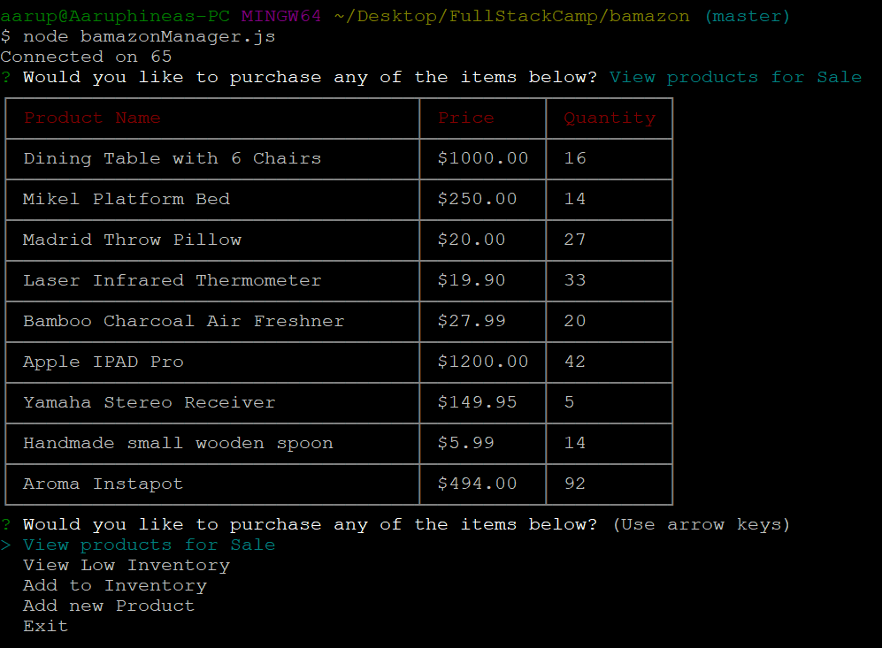

First part of the application is the user interface.Following are the functionalities which the app would perform
1. Once the js is executed all the available products are displayed with their price and available quantity

Also customers are given with the list of available products for them to choose from to purchase a product. 
Once they choose a product to buy they are prompted to get their desired quantity . When they choose the quantity the information is updated in the 
database and also their total cost of the purchase is displayed as shown below

If the user wants they can continue buying products or they can exit.

Second part of the application is the Manager interface. 
1. Following are the options given to the manager 

When View Products for Sale is chosen all the products available are shown as below 

2. When the second choice 'View Low Inventory' is chosen all the products which has low inventory (less than 5 items) are shown 

3. When 'ADD to inventory' is chosen the products with low inventory will be given as choices to update the inventory

The quantity is updated in the database

4. When 'Add new Product' is chosen

Third part of the application is the Supervisor interface
1. Following are the choices given to the supervisor 

2. When 'View product sale by department' is chosen two tables are joined by an inner join and following information is shown to the supervisor

3. When create new product is chosen a new product is created in the table. 

